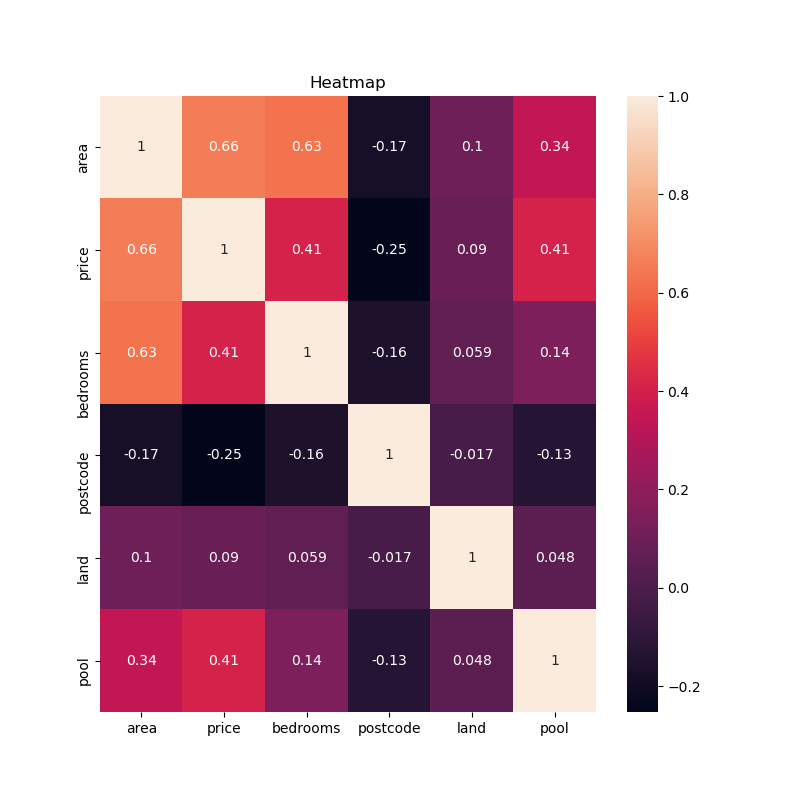
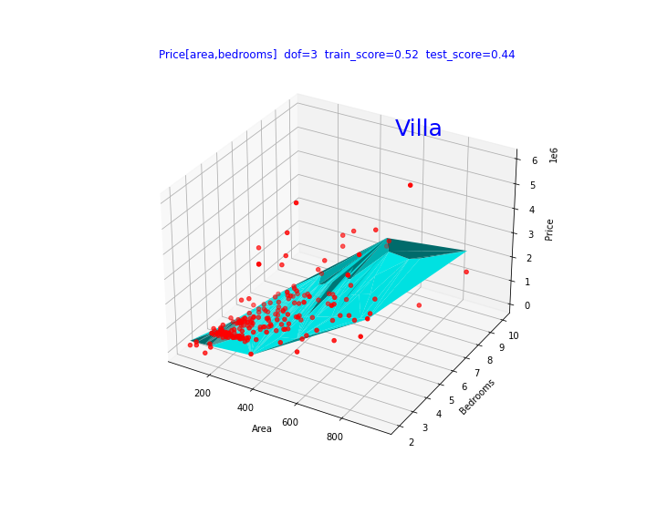

# Description

This is a job we received from the real estate company "ImmoEliza".
The goal was to create a machine learning model to predict prices on Belgium's real estate sales in Belgium.
For this we were handed a database on all the houses for sale, on 16/06/2021.
In this repository you will find all the data we collected and all the code we used, along with our findings.

# Installation

## Python version

* Python 3.9

## Packages used

* Numpy
* Pandas
* Matplotlib
* Sklearn
* Seaborn

# Usage

|Filename                                       |Usage                                               |
|-----------------------------------------------|:--------------------------------------------------:|
|Immo_Elisa_house_data_analysis_regression.ipynb|Jupyer Notebook file containing Python code. Used to clean the data. Used to do preliminary analysis, model selection and apply polynimial linear regression to find insights.      |
|final_list_houses_dataset.csv                  |File containing data of houses for sale, in Belgium. Contains price, area, building state, etc...  |

# Visuals

## Heatmap showing correlation between all features and price.

## Plot showing high price of villa in brussels region then other region in Belgium.

# Contributors

|Name                 |GitHub                              |
|---------------------|:----------------------------------:|
|Amaury van Kesteren  |https://github.com/AmauryvanKeste   |
|Jacques Declercq     |https://github.com/JacquesDeclercq  |
|Jayesh Italiya       |https://github.com/JayeshItaliya86  |
|Michel Ombessa       |https://github.com/mdifils          |

# Timeline
14/07/2021 - 16/07/2021
